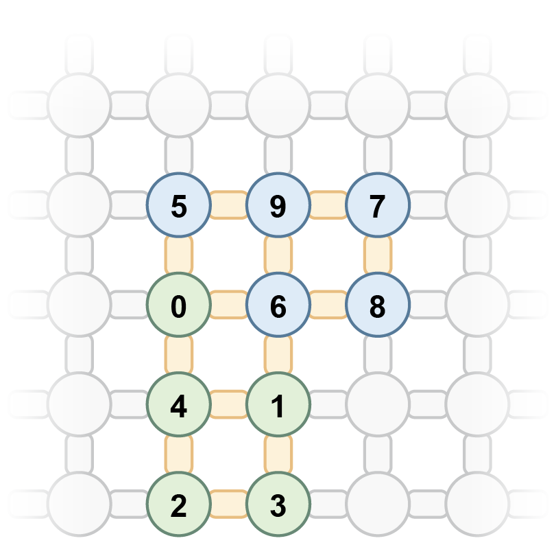

# Simulating unsteady flows on a superconducting quantum processor

# Read data with python
    import pandas as pd
    data = pd.read_excel("file_name", index_col=0, sheetname=None)

# Qubit index convention
In order to facilitate the display of elegance, a more intuitive index convention has been selected in the main text. Under this convention, the computational bases for enconding flow states are denote as $|Q_6 Q_{10} Q_8 Q_9 Q_7 Q_1 Q_5 Q_3 Q_4 Q_2\rangle$. In the experiment, we actually take the encoding convention with the qubit index shown as below:

.

Under this convention, the computational bases for enconding flow states are denote as $|Q_0 Q_1 Q_2 Q_3 Q_4 Q_5 Q_6 Q_7 Q_8 Q_9\rangle$. Note that we follow the encoding convention in this depository.

## Contents
- [Data availability](data_availability)
Here we provide the experimental data presented in the figures and that support the other findings of this study.
- [Code availability](code_availability)
Here we provide the simulation code for Fig. S8 and Fig. S9 in Supplementary Information. Run ["run.ipynb"](./code_availability/run.ipynb) to generate corresponding simulation result files.